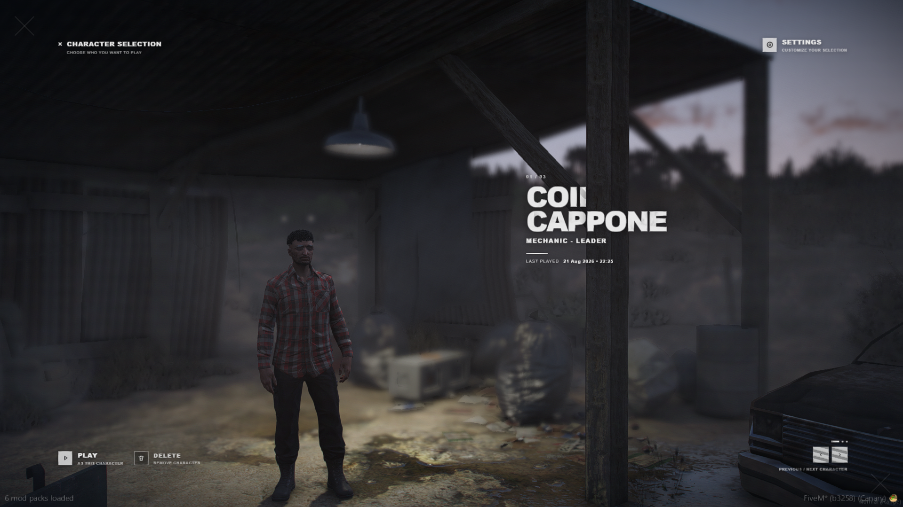
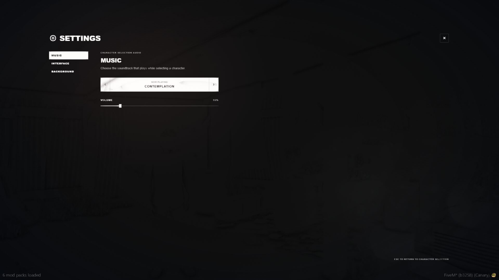
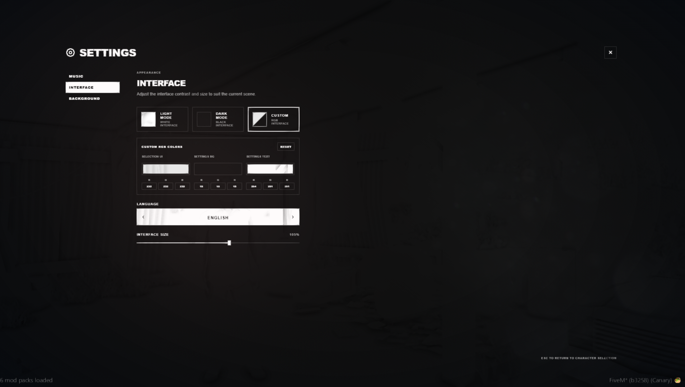
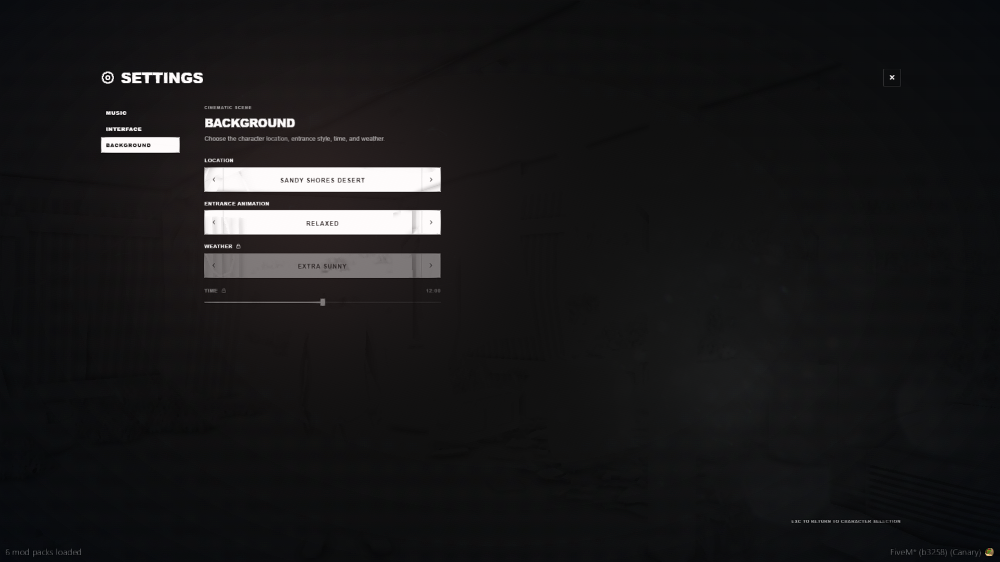
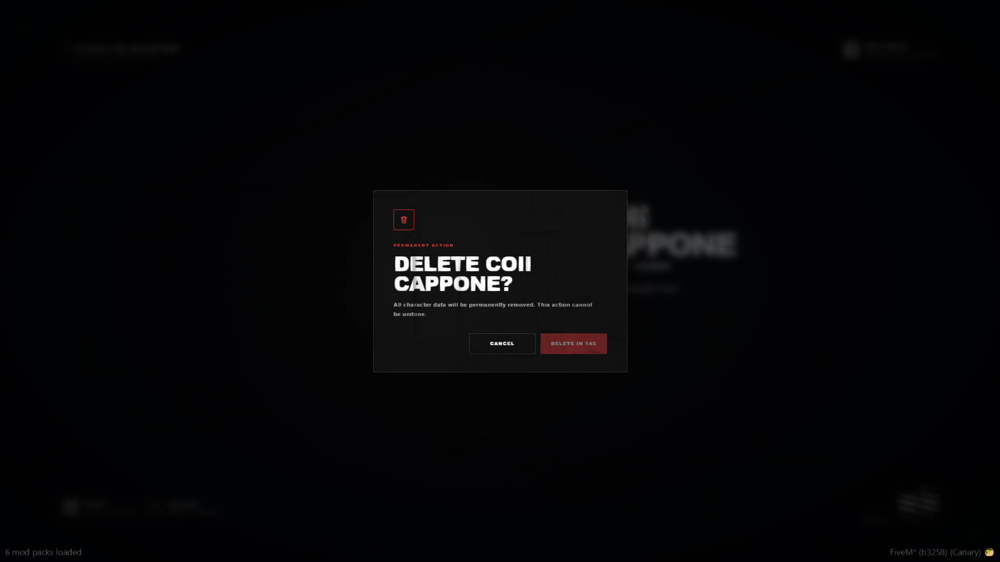
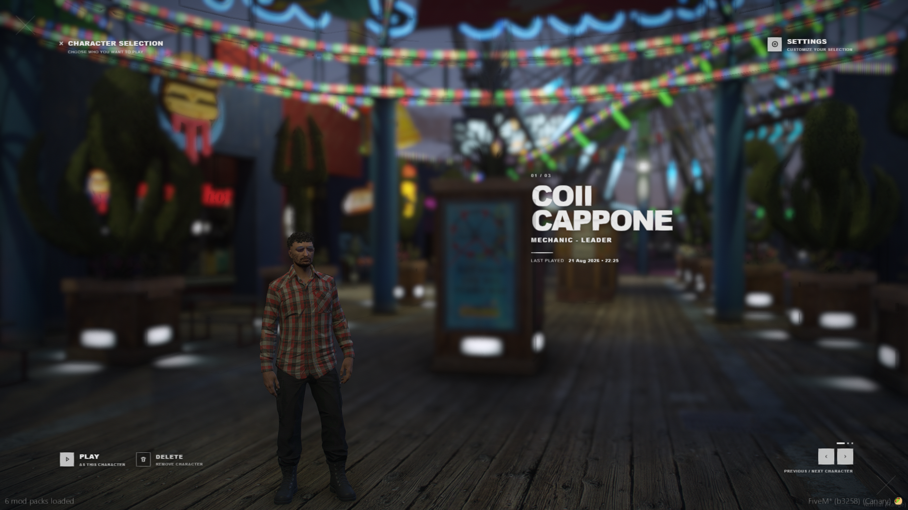

# COII Multicharacter

A cinematic ESX Legacy multicharacter replacement for FiveM. It provides configurable character preview scenes, persistent player preferences, optional paid character slots, localization, music, character deletion, and server-side validation.

## Features

<p align="center">
  
  
  
  
  
  
</p>

- Cinematic character preview with configurable locations and camera offsets
- Smooth character fade, focus-rack, depth-of-field, and camera-breathing effects
- Configurable entrance animations, weather, and time of day
- Optional local NPC and vehicle suppression during character selection
- Character name, job and last-played date
- Light, dark, and custom RGB interface themes
- Player-adjustable interface scale
- Local MP3 soundtrack selector and volume control
- Persistent settings stored per ESX identifier
- English, Croatian, German, Slovenian, and French locales
- Free, paid, locked, empty, and disabled character-slot states
- Configurable Store URL for a website, Tebex page, or Discord invite
- Character deletion with a 15-second confirmation countdown
- Server-side character ownership, slot, session, and deletion validation
- Recovery handling for database, NUI, transition, spawn, and resource-restart failures

## Installation

1. Back up your server files and database.
2. Remove or rename the original `esx_multicharacter` resource. Do not run both resources simultaneously.
3. Copy this resource into your server's `resources` directory.
4. Name the resource folder exactly `esx_multicharacter`.
5. Configure [`config.lua`](config.lua).
6. Keep `Config.AutoMigrate = true`, or import [`install.sql`](install.sql) manually.
7. Start the dependencies before this resource in `server.cfg`.


The resource name matters. ESX uses `esx_multicharacter` to enable its multicharacter flow, and the resource will print a warning when installed under a different name.

## Database

With `Config.AutoMigrate = true`, the resource automatically:

- Creates `coii_multicharacter_slots`
- Creates `coii_multicharacter_preferences`
- Adds `users.last_played` when missing
- Adds `users.disabled` when missing
- Migrates compatible slot overrides from the stock `multicharacter_slots` table on first installation

The database account used by oxmysql needs permission to create and alter tables. If automatic migration is disabled, import [`install.sql`](install.sql) before starting the resource.

## Configuration

### General

| Option | Purpose |
| --- | --- |
| `Config.RequiredResourceName` | Required ESX resource folder name |
| `Config.Prefix` | Character identifier prefix, normally `char` |
| `Config.Locale` | Default server language |
| `Config.AutoMigrate` | Creates and updates required database structures |
| `Config.Debug` | Enables additional server logging |
| `Config.CanDelete` | Enables character deletion |
| `Config.Relog` | Enables the `/relog` command |
| `Config.AllowClose` | Controls whether the selection NUI can be closed |

### Paid slots and Store URL

```lua
Config.PaidSlots = {
    Enabled                        = true,
    FreeSlots                      = 2,
    TotalSlots                     = 3,
    PriceLabel                     = 'PAID CHARACTER SLOT',
    GrandfatherExistingCharacters = true,
    StoreEnabled                   = true,
    StoreUrl                       = 'https://your-site.example/'
}
```

When a player selects a locked slot, the Buy Slot button opens `StoreUrl`. The URL may point to a store, website, or Discord invite.

Opening the URL does **not** automatically unlock a slot. An administrator, another server resource, or a future commerce integration must grant the entitlement.

`GrandfatherExistingCharacters` automatically preserves access for players who already have characters above the configured free-slot limit.

When `Enabled = false`, paid-slot locking is disabled and every configured slot is available for character creation. Set `FreeSlots` to the desired slot count; the resource automatically raises the effective total when `TotalSlots` is lower.

### Interface defaults

`Config.PreferenceDefaults` controls the initial locale, theme, RGB colors, music track, volume, and interface scale. After a player changes these values, their personal settings take priority and are saved in `coii_multicharacter_preferences`.

### Scene settings

`Config.Scene` controls:

- Time and weather selector availability
- 24-hour or 12-hour time display
- Default location, animation, time, and weather
- Camera and play-transition offsets
- Character fade duration
- Depth of field and focus-rack behavior
- Camera breathing
- Local population suppression

When another resource such as `cd_easytime` controls time or weather, disable the corresponding selector:

```lua
Config.Scene.TimeSettingsEnabled = false
Config.Scene.WeatherSettingsEnabled = false
```

Disabled options remain visible with a lock icon and do not override the external resource.

### Locations and animations

Add preview locations to `Config.Backgrounds` using a unique ID, display label, and `vector4` coordinates:

```lua
{ id = 'pier', label = 'LOS SANTOS PIER', coords = vector4(-1700.72, -1091.35, 13.15, 85.82) }
```

Add entrance styles to `Config.AnimationStyles`. Animation dictionaries and names must be valid GTA V animations.

## Music

Place distributable MP3 files in:

```text
html/music/
```

Then register each track in `Config.Music.Tracks`:

```lua
Config.Music = {
    Folder = 'music',
    Tracks = {
        { File = 'track-name.mp3', Label = 'TRACK NAME' }
    }
}
```

Only `.mp3` files configured in the track list are loaded. `MusicTrack = 0` disables music; positive values select a configured track.

Bundled music:

- `dream-ambience.mp3` - "Dream Ambience" by TokyoGeisha, released under [CC0 1.0](https://opengameart.org/content/dream-ambience).
- `contemplation.mp3` - "Contemplation" by Joth, released under [CC0 1.0](https://opengameart.org/content/contemplation-0).

## Locales

Available locale IDs:

| ID | Language |
| --- | --- |
| `en` | English |
| `hr` | Croatian |
| `de` | German |
| `sl` | Slovenian |
| `fr` | French |

Set the server default with:

```lua
Config.Locale = 'en'
```

Players can choose their own language under Interface settings. Add or edit translations in [`locales.lua`](locales.lua), and keep every locale key synchronized.

## Character-slot administration

The default commands are configured in `Config.Commands`.

```text
/grantslot [serverId or identifier] [amount]
/revokeslot [serverId or identifier] [amount]
```

The server console, ESX `admin` and `superadmin` groups, and players with the configured ACE permission may use these commands.

```cfg
add_ace group.admin coii_multicharacter.admin allow
```

### Server exports

Other server resources can grant or revoke paid slots:

```lua
local success, message = exports['esx_multicharacter']:GrantPaidSlots(source, 1)
local success, message = exports['esx_multicharacter']:RevokePaidSlots(source, 1)
```

The first argument may be an online server ID or a complete ESX identifier.

### Integration events

The resource emits a server-side event when a player requests a locked slot:

```lua
AddEventHandler('coii_multicharacter:purchaseRequested', function(playerId, identifier, slot)
    -- Log the request or connect your entitlement workflow here.
end)
```

After a successful deletion it emits:

```lua
AddEventHandler('coii_multicharacter:characterDeleted', function(playerId, characterIdentifier, slot)
    -- Optional integration cleanup or logging.
end)
```

### A paid slot remains locked

- Opening the Store URL does not grant entitlement by itself.
- Use `/grantslot`, the `GrantPaidSlots` export, or your commerce integration.

## License

Copyright (C) 2026 COII.

This project is free software licensed under the [GNU General Public License v3.0 only](LICENSE), identified by the SPDX expression `GPL-3.0-only`.

The GPL applies to the project code. The two bundled music tracks are separate CC0 works documented in the Music section above and are not claimed as original COII music.
